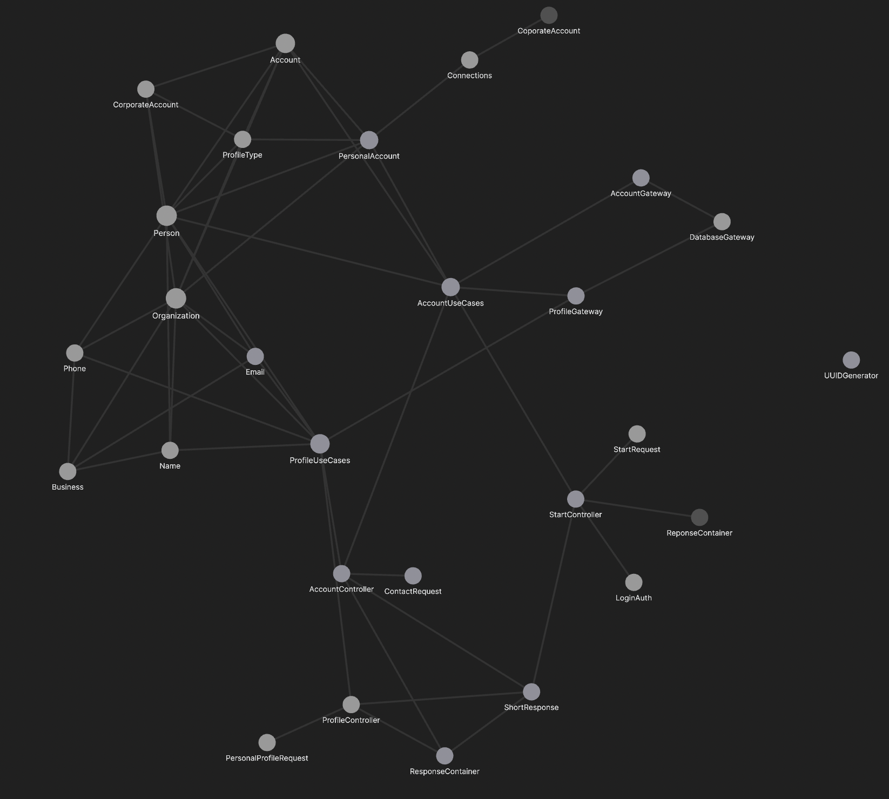

# kard Phase 1 design document

## Contents
- [Summary](#description-of-work-done)
- [Navigating Github](#navigating-the-github-repository)
- [Project Structure](#description-of-project-structure)
    - [Packaging](#packaging)
- [Design and Architecture](#design-and-architecture)
    - [SOLID](#solid)
    - [Clean Architecture](#clean-architecture)
    - [Design Problems](#design-problems)
    - [Design Patterns](#design-patterns)
- [Description of the UI](#descriptions-of-the-ui)
    - [Flutter App](#flutter-app)
    - [CLI](#command-line-application)
- [Other Notes](#other-notes)
    - [Refactoring](#refactoring)
    - [Use of Github](#use-of-github-and-git)
    - [Questions](#some-questions)
- [Contributions](#major-contributions-to-kard)

## Description of Work Done

As of November 5, much progress has been made to kard including but not limited to:

- Update of the code base initially referred to as the skeleton code to more closely adhere to guidelines set out in the updated CRC cards from phase 0.
- Update documentation to include the ability to include the idea of accounts including signing up and signing in.
- Update of the kard backend to now function purely as a [Spring](https://spring.io) server that accepts and sends HTTP requests to interact with the database
- Implemented multiple different UI's including:
  - Basic login and signup functionality on a smartphone application built in Flutter and Dart. This application can be shipped on Android and iOS.
  - CLI with functionality to interact with the server backend
- Implemented classes for instantiatable entities like `email` and `phone`. These will provide the user with the ability to add multiple of these attributes to their profile

## Navigating the Github Repository

At the root dirctory of the Github repository there are three separate IntelliJ projects.
  - [kard-server](https://github.com/CSC207-UofT/course-project-purplemongoose/tree/main/kard-server) - The server backend for kard. This is the core of kard
  - [kard-cli](https://github.com/CSC207-UofT/course-project-purplemongoose/tree/main/kard-CLI) - A separate project for the command line. This project needs `kard-server` to be running as it uses it as a back end and communicates with it using HTTP requests
  - [kard_project_test](https://github.com/CSC207-UofT/course-project-purplemongoose/tree/main/kard_project_test) - A mobile app for kard written in Flutter and Dart. This project also needs `kard-server` to be running since it relies on it as a backend and also uses HTTP to send requests.

> Note that there is a directory called 'kard' which currently houses a work in progress re-tool or 'kard_project_test'. Please ignore it for phase 1 as it is very preliminarty. We meant to keep it on a branch, however due to a mistake in a push, it got merged to main.

## Description of Project Structure

Currently the project works in a server client manner. The servers responsibilities include doing computations and providing methods for interacting with the SQLite database.

The clients responsibility consists solely of getting the data and displaying it in a user friendly manner.

In this way, the project largely follows guidelines set out in Clean Architecture.

### Packaging

The current package structure is set up for initial development to ensure that the program adheres to clean architecture with the packages being the individual layers. Therefore, we have chosen to package by layers. Doing so made it very easy to spot violations of clean architecture since the import statements clearly showed a different layer was being addressed.

We are currenting considering different packaging structures for phase 2, however we have found that packing by layer has worked quite well so far to keep everything organized.

## Design and Architecture

### SOLID

Some of our code follow the single responsibility principle. For example `LoginAuth` only deals with authenticating the login information and returning back whether the attempt was successful for not. However, some classes might be too large and encompassing. Take `AccountUseCases` as an example; it contains methods that create Account instances while also having methods that modify the contacts in accounts. We instead should separate `AccountUseCases` into two separate classes - one that deals with the creation and deletion of Account objects (maybe called `ManageAccount`) and the other which deals with the contacts of account (`ManageContacts`). This problem was more due to issues with selecting viable names for certain classes at the beginning, so we just decided to clump everything to do with accounts under one umbrella class.

As for the other principles (OLID), our code current does not have the depth to showcase the them well. This is because the major improvements on our program for phase 1 were mostly on the frontend side of things (Flutter GUI, CLI, REST API). As a result, the backend functionality only consists of creating an account and profile, logging in, and adding a profile to the accounts contacts list. For phase 2, we plan on adding the algorithmic brunt of our program which will be creating and editing various cards which will definitely showcase the SOLID principle much better. We also plan on adding layers of separation between the various layers to make testing easier which will also apply SOLID principles.

### Clean Architecture

We should note that due to the large amount of effort initially to design our CRC cards to follow Clean Architecture closely and during the re-write, the code has been very straightforward to expand on and edit features. With the Dependency Rule being followed for every layer, a re-write of the controllers to allow for HTTP functionality required no editing to the entities and use cases since they did not rely on each other. 

To see how we have applied clean architecture visually, we have included an annotated UML diagram where the layers are marked out. As seen, there are clear separation between the 4 layers, and the dependency goes in one direction for most of the layers. However, we realize that our gateway layer is actually used by our usecases, when according to clean architecture, it should be the usecases that are used by gateways, so restructuring this part of the code will be a priority in Phase 2. Also, notice there are classes that are not included in any of the layers. These classes serve more of a helper functionality to the controllers as all they are designed to do is interpret JSON files and store HTTP responses, which are all handled with the controllers. 

- Scenario Walkthrough
Suppose the GUI sends a request for a new account to be made. `submitSignUp` from `StartController` would then receive that request and call `createNewAccount` from `AccountUseCases` to create an account. `createAccount` then instantiates a new `PersonalAccount` object and calls the insertAccountData from `AccountGateway` to add it to the database along with the username and password sent over with the request.

The Dependency Rule states that source code dependencies should only point outwards. An example of this would be the `ProfileUseCases` class. It imports `ProfileGateway` and various entity classes but does not import from the controllers thus keeping in line with the Dependency Rule.

### Design Problems

Some of the design decisions have made testing for the program quite difficult. One of the main issues with our current program is that some of the components are too closely bound and do not have a good layer of separation. For example, the use cases directly call the gateway which itself directly access the database. So what ends up happening is that it becomes impossible to test the use cases with unit tests without having a ton of boiler plate code in the tests. 
    
To remedy this, we plan only having one gateway for the database as opposed to two since you can just have two tables in a single database (realized too late). Additionally, we plan on rewriting the gateway to have another layer of abstraction (something like an SQLHelper class) on top to allow the usecases to be tested on some dummy object rather than an actual SQLite database. We also will add a boundary layer for classes that interact too closely with other classes to make testing of individual components easier.

### Design Patterns

Unfortunately due to time constraints, we were not able to effectively implement effective design patterns. For example, the Command design pattern could make our database much more flexible with search requests as we can combine a set of simple commands into a more complex one. The Builder and Factory design patterns would have also allowed us to more effectively create some of our more complicated entities and Momentos would allow us to implement editing which is in our roadmap.

## Descriptions of the UI

### Flutter App

The Flutter GUI has been designed with Material Design and Material You principles in mind with the intention to make it as scalable and universal as possible. 

Note that the current GUI only has the functionality for a user to sign up and log in to the kard program. Further work has been completed, ho

### Command Line Application

For phase 1, we have changed our controllers to respond to HTTP requests, namely GET and POST. This is an attempt to implement some form of REST API into our backend as to allow the frontend to be completely disonnected from the backend. For example, if you want to login, the application you are using would need to send a POST request to `http://host-IPv4:port/start/login/` containing the JSON `{accountUsername: username, accountPassword: password}`. This is currently how the server backend communitcates with the Flutter GUI and Java CLI.

## Other Notes

### Refactoring

Significant changes to the codebase have been made on multiple occasions. Over these changes, we have renamed methods, and class, and even re-written some to better fit with our program.
    
Some specific examples where refactors have happened:
- We moved the main project from the root directory of the git to [kard-server](https://github.com/CSC207-UofT/course-project-purplemongoose/tree/main/kard-server). See [pull request 39](https://github.com/CSC207-UofT/course-project-purplemongoose/pull/39).
- We changed the name of a 'user' to 'account' around the program. We thought that the new name better represented the function of an 'account' in kard and allowed us to differentiate it from a profile. A profile stores the personal information of a user while an account stores the profile of the user and the users' contacts list.
    - This refactor happened through different pull requests so specifice commits have been provided
    - [Initial file change](https://github.com/CSC207-UofT/course-project-purplemongoose/commit/f09820649ae6769df60e03e69802722309805815) This is when we initially changed the file and class name.
    - [Changes around kard](https://github.com/CSC207-UofT/course-project-purplemongoose/pull/25/commits/4dcb2b6b30ba0ae5948fa9a7bc372f2f37f49833) This is when code was changed to reflect the new file and class name
    - [Some general restructuring](https://github.com/CSC207-UofT/course-project-purplemongoose/pull/22) These were largely to clean up old code and to prepare for the restructure.
    

### Use of Github and Git

Git has been used extensively to manage and facilitate the development of kard. We constantly use branches whenever new features are being added to stage them and test before merging to main. Minimal committing to main have been made as we kept main as a fully working and tested version of the code. 

There has been limited usage of Github issues and actions - for issues in the code, we have used our Discord Server to communicate. As for actions, we plan on implementing some for phase 2 to ensure that there is some automatic checking of files that we push.
    
### Some questions

For documentation, do getters and setters require javadocs?

## Major Contributions to kard

| Name     | Responsibilities                                             |
| -------- | ------------------------------------------------------------ |
| Arthur   | Develop Flutter GUI Maintain Git and manage merge requests Coordinate group meetings and roadmap Design Documentation |
| Ling     | Wrote controllers and added HTTP request/response   Wrote use cases   Designed and wrote database and gateways   Design document and Javadocs |
| Victoria | Develop entities for the program Write tests and documentation for entities |
| Stewart  | Develop an updated backend database infastructure (not implemented in phase 1) Write tests for kard server |
| Kevin    | Develop and maintain CLI through different iterations of the backend Write tests for kard server |
| Sila     | Write tests for kard server                                  |

