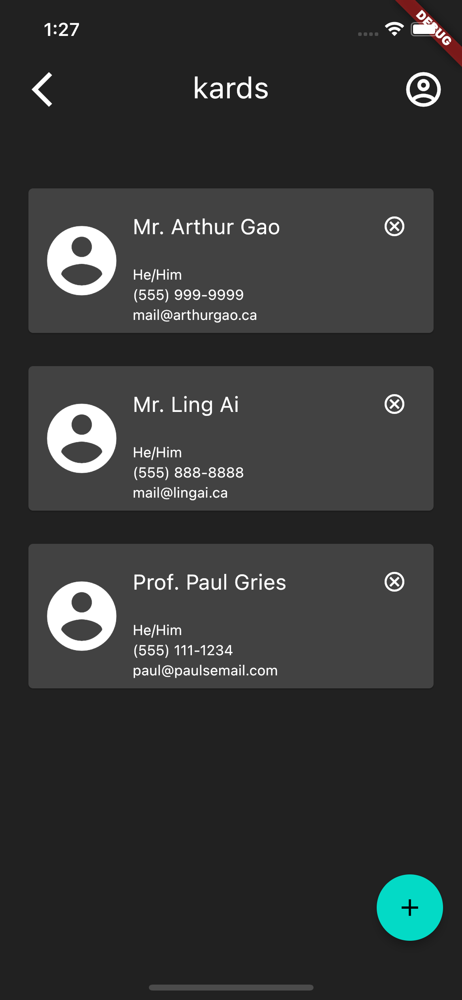
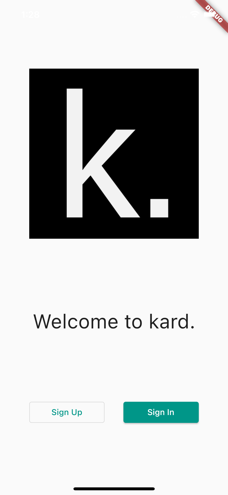
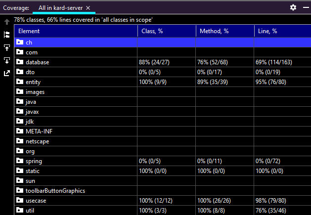

# kard Phase 2 design document

<details>
  <summary>Contents</summary>

## Contents

- [Critical Documents](#other-critical-documents)
- [Description of Work Done](#description-of-work-done)
- [Navigating Github](#navigating-the-github-repository)
- [Using Kard](#using-kard)
- [Project Structure](#description-of-project-structure)
- [Server Implementation Details](#kard-server-implementation-details)
- [Application](#kard-application)
- [Deployment](#deployment-of-kard)
- [Design and Architecture](#design-and-architecture)
- [Clean Architecture](#clean-architecture)
- [Design Patterns](#design-patterns)
- [Other Notes](#other-notes)
- [Contributions](#major-contributions-to-kard)

</details>

## Other Critical Documents

- [PDF of our powerpoint presentation from Dec 6th](https://github.com/CSC207-UofT/course-project-purplemongoose/blob/main/phase2/CSC207-KARD.pdf)
- [Final updated project specification](https://github.com/CSC207-UofT/course-project-purplemongoose/blob/main/phase2/specification.md)
- [Accessibility document](https://github.com/CSC207-UofT/course-project-purplemongoose/blob/main/phase2/accessibility.md)
- [Our responses to phase 1 feedback](https://github.com/CSC207-UofT/course-project-purplemongoose/blob/main/phase2/Phase1_Feedback.md)
- [Project Wiki](https://github.com/CSC207-UofT/course-project-purplemongoose/wiki)

<br/>

<div align="right">
    <b><a href="#kard-phase-2-design-document">↥ back to top</a></b>
</div>
<br/>

## Description of Work Done

As of December 9, an initial shippable version of kard has been completed:

- Update of the phase 1 code base addressing concerns and feedback from phase 1. Detailed breakdown to the responses and changed stemming from phase 1 feedback can be found [here](https://github.com/CSC207-UofT/course-project-purplemongoose/blob/main/phase2/Phase1_Feedback.md)
- Update the Kard Flutter application to reach near feature parity with the command line application including
  - Signing up and creating an individual profile
  - Logging in and accessing an individuals contacts
  - Adding a new contact based on username
  - Removing a contact
- Updated the Kard Flutter application to better adhere to accessibility guidelines laid out in Googles [Material Design 2](https://material.io/design) and [Material Design 3](https://m3.material.io) guidelines.
- Added sorting to fetch order for contacts. A user can now sort their contacts alphabetically.
- Added rollback ability to individual profiles, allowing users to view and rollback changes they made to their profile like an erroneous edit.
- Massive overhaul of the SQLite database to allow for more flexibility.

<br/>

<div align="right">
    <b><a href="#kard-phase-2-design-document">↥ back to top</a></b>
</div>
<br/>

## Navigating the Github Repository

 At the root dirctory of the Github repository there are three separate IntelliJ projects.

   - [kard-server](https://github.com/CSC207-UofT/course-project-purplemongoose/tree/main/kard-server) - The server backend for kard. This is the core of kard
   - [kard-cli](https://github.com/CSC207-UofT/course-project-purplemongoose/tree/main/kard-CLI) - A separate project for the command line. This project needs `kard-server` to be running as it uses it as a back end and communicates with it using HTTP requests. Note that by default, 
   - [kard](https://github.com/CSC207-UofT/course-project-purplemongoose/tree/main/kard_project_test) - A mobile app for kard written Dart using the Flutter framework. This project also needs `kard-server` to be running since it relies on it as a backend and also uses HTTP to send requests.

<br/>
<div align="right">
    <b><a href="#kard-phase-2-design-document">↥ back to top</a></b>
</div>
<br/>

## Using Kard

When testing kard, the user may create a new user. There are a few default profiles set up with the following usernames:

```
arthurgao
lingai
paul
```

All of the above profiles are on the version of kard server at cloud.arthurgao.ca:9082 and are full addable by any new user of kard.

You may also create multiple accounts and add yourself. Just note that no two account may have the same username.

<br/>
<div align="right">
    <b><a href="#kard-phase-2-design-document">↥ back to top</a></b>
</div>
<br/>

## Description of Project Structure

Currently the project works in a server client manner. The servers responsibilities include doing computations and providing methods for interacting with the SQLite database.

The clients responsibility consists solely of getting the data and displaying it in a user friendly manner.

### Packaging

We ended up choosing to package by clean architecture layer as we thought that this organized our code in a way that made it easy to find as we wanted to ensure that data flow closely followed guidelines set out by clean architecture which made finding code in packages coming from layers relatively easy compared to other methods.

Another benefit of packaging by layer is that it was very easy to spot violations of clean architecture since the import statements clearly showed a different package and therefore layer was being addressed.

After packaging by layer, the sub packages are by feature, which allowed us to group code for different features together to make the both easier to find, and limit their scope, thus helping us fulfill the single responsibility principle. 

<br/>
<div align="right">
    <b><a href="#kard-phase-2-design-document">↥ back to top</a></b>
</div>
<br/>

## Kard-Server Implementation Details

In phase 1, kards backend was modified so that instead of running a command line application, it responded to HTTP GET and POST requests. In doing so, we implemented a form of a [RESTful API](https://www.redhat.com/en/topics/api/what-is-a-rest-api) into our backend, allowing any frontend user interface, like the command line or mobile application, to be completely disconnected.

For phase 2, we have continued development down this path by further developing the controllers to adhere to REST. In phase 1, some of the controllers used did not GET and POST properly. GET meant for viewing something in the backend while POST is used to change some values in the backend. In phase 2, GET and POST are used in proper places as opposed to phase 1 where GET was mainly used (improperly).

The implementation of the RESTful API can be observed throughout the entire app, with a specific example being if a user wishes to login. In this example the application the user is using would send a POST request to `http://host-IPv4:port/kard/login/` containing the JSON `{accountUsername: username, accountPassword: password}`. The server would then receive and process this request, returning to the user interface application another JSON containing the result of the login function specifically whether the password matches the username and the can, therefore, login.

The benefit following RESTful API is that it allows for one centralized backend (and database) for the frontend to communicate with. If each frontend were to have its own backend that it communicate directly with, it would be difficult to synchonize account data and profiles without needing alot of network related code or switching to a server based database like MySQL or MongoDB. Using HTTP requests has allowed us to create a highly customizable database with SQLite while avoiding the complications of signing up and connecting to a server database.

<br/>
<div align="right">
    <b><a href="#kard-phase-2-design-document">↥ back to top</a></b>
</div>
<br/>

## Kard Application

The final kard deliverable application is coded in [Dart](https://dart.dev) using the open source [Flutter Framework](https://flutter.dev) allowing us to build a iOS, Android, and Web apps simultaneously with one Dart code base. The application was built to follow [Material Design 2]() and to a certain extent [Material You (Material Design 3)](), however Material Design 3 implementation is limited as it was released during the development of kard. If we continue development on the application, a future goal would be to shift all components to the Material You versions.

The front end dart application was built purely as a way to display the information processed by the back end in a human friendly manner. It is the servers responsibility to handle everything from authentication, to profile storage, to creation and management of profiles. All the app does is store a temporary version of the profiles for a given user to view and discard those when the app is closed. A new login would subsequently fetch the latest version of the users contacts from the server allowing kard to be used on multiple devices without issue. 

The kard application has been developed on both iOS and Android devices and is fully tested and confirmed working on both. 

A screenshot of the kard application home screen running on iPhone:



A screenshot of the Landing Screen of kard running on iPhone:




<br/>

<div align="right">
    <b><a href="#kard-phase-2-design-document">↥ back to top</a></b>
</div>
<br/>

## Deployment of Kard

The final version of Kard-server was built by maven and then wrapped into a fat jar containing all the dependencies necessary to run kard, some of these include Junit5 and Spring Boot. This jar was then built into a docker container and uploaded to Docker Hub under Affixrevy/kard. This docker hub container was then deployed on Arthur's personal server where it is accessible to the web after port forwarding at "cloud.arthurgao.ca:9082". Real HTTP requests can be made to this address anywhere in the world and they will be handled by Arthur's server, running a version of kard-server. This functionality has been tested on both CLI and Android, away from the local network in Arthurs condo. 

<br/>

<div align="right">
    <b><a href="#kard-phase-2-design-document">↥ back to top</a></b>
</div>
<br/>

## Design and Architecture

As we've pointed out in the design document for phase 1, the OLID principle were lacking in the previous iteration of our project. However for phase 2, we made it our goal to ensure these principle are present.

**S:** We used to bundle all account related use cases in one mega class called `AccountUseCases` and that same pattern was followed for other use cases. In phase 2 we removed these huge use case classes and separated them out into smaller classes which have specific roles (e.g. `CreateAccount` only handles account creation). Additionally, the controllers only are only responsibile for one branch of requests. For example the `ContactController` only contains methods that act on contacts, those being `submitContactAddition`, `submitContactRemoval`, `submitContactDisplay`. By separating the controllers into their respective role, the URL for the controllers becomes quite easy for frontend applications to use. If the Flutter app wanted to display the contacts, it would just send a request to `http://host-url:8082/contact/display`.

**O:** Although Open-Closed Principle is used in various sections of our program, it is most commonly seen in entities as they lay the foundation of our program. For example, in our profile entities, we have `ProfileType` as  the interface which all profile classes must implemenent. Due to time constraints, we only have `Person` as the profile class, but if given more time, we could have implemented classes like `Company` which could be a parent class of `Business`, and so forth. Our memento classes also implement `ProfileType`; without having to modify the subclasses of `ProfileType` to support mementos, we have a class like `PersonMemento` which extends `Memento` which implements `ProfileType` instead. As a result, our entities are open for extension, but closed for modification.

**L:** While our entities are a good showcase of Liskov Subsitution Principle, our current iteration of the program only has one subclass of each entity interface superclass. However in our Strategy design pattern implementation of contact sorting, Liskov Subsitution principle is present. The interface `SortBehaviour` has `SortByName` as an implementor. The `sort` method for `SortByName` and other possible subclasses (e.g. `SortByTimeStamp`) will only ever take in a array of `ProfileType` objects and the order in which to sort it (`"ascend"`, `"descend"`). As such `.sort()` of all the subclasses of `SortBehaviour` can be used wherever `SortBehaviour.sort()` is used.

**I:** An example the Interface Segregation Principle can be found in `PersonalAccount` which implements `Account`. `Account` contains the following methods: `addContact`, `removeContact`, `checkContact` and `getContacts`. In `PersonalAccount` all of these methods are implemented and make sense contextually (as opposed to something like a square class implementing a shape interface with a volume method) All the subclasses that are implementing an interface support the methods from the superclass that are being inherited. There are no errors in Intelliji about subclasses not implementing superclass methods so all the subclasses that are implementing an interface support the methods from the superclass being inherited.

**D:** The Dependency Inversion Principle is used in our project, but is best demonstrated in our database implementation. Many if not all of our use cases rely on accessing the database in some way. Originally,
the database classes which directly interacted with the SQLite wrapper class was coupled to the use cases. This meant testing was impossible to do with use cases and more importantly, broke the Dependency Inversion Principle as the high level modules (use cases) depended on low level modules (database wrapper). In phase 2, we added a layer of separation by introducing `SQLiteDataBaseHelper` and `DataBaseGateway`. `SQLiteDataBaseHelper` provides an interface to the database for the gateways while the gateways obfuscate the database implementation for the use cases by providing a high level layer of interaction. As a result, the use cases now depend on `DataBaseGateway` which itself depends on `SQLiteDataBaseHelper`. Instead of depending on concretions, the use cases now depend on abstraction and thus follows the Dependency Inversion Principle.

<br/>
<div align="right">
    <b><a href="#kard-phase-2-design-document">↥ back to top</a></b>
</div>
<br/>

## Clean Architecture

We should note that due to the large amount of effort initially to design our CRC cards to follow Clean Architecture closely and during the re-write, the code has been very straightforward to expand on and edit features. With the Dependency Rule being followed for every layer, a re-write of the controllers to allow for HTTP functionality required no editing to the entities and use cases since they did not rely on each other. 

To see how we have applied clean architecture visually, we have included an annotated UML diagram where the layers are marked out. As seen, there are clear separation between the 4 layers, and the dependency goes in one direction. Also, notice there are classes that are not included in any of the layers. These classes serve more of a helper functionality to the controllers as all they are designed to do is interpret JSON files and store HTTP responses, which are all handled with the controllers. 


### Scenario Walkthrough
Suppose the GUI (CLI or Flutter) sends a request for a new account to be made. `submitPersonalAccountCreate` from `AccountController` would then receive that request and call `newPersonalAccount` from the `CreateAccount` use case to create an account. `createNewPersonalAccount` then instantiates a new `PersonalAccount` object and calls `insertAccountData` from `AccountGateway` to add it to the database along with the username and password sent over with the request. 

The Dependency Rule states that source code dependencies should only point outwards. An example of this would be the `ProfileUseCases` class. It imports `ProfileGateway` and various entity classes but does not import from the controllers thus keeping in line with the Dependency Rule.

<br/>
<div align="right">
    <b><a href="#kard-phase-2-design-document">↥ back to top</a></b>
</div>
<br/>

## Design Patterns

There are 4 main design patterns used in our project:

- Command
  - The command design pattern is used for the database in the queries and statements, to allow for greater flexibility and detach the process of authoring a command from the process of executing it.
  - We create abstract statement and query classes that have two roles, two be executed on a database, and in the case of queries, to arrange the data in the form required for a given query.
  - The alternative would mean that the caller would have to make a function call to the database, this means unnecessary bloat in the calling class as well as the callee class to facilitate that.
  - By introducing the command design pattern, the callee needs to know nothing about the caller and vice versa, all of that bloat, ends up in its own dedicated class and is no longer bloat.
  - This has allowed us to write more powerful queries and avoid nasty violations of clean architecture.
    - For example, the `SQLitePasswordQuery` is created by passing in a username and password.
    - Then, the caller can call `matches()` to get back a boolean value containing whether the username matches the password in the database.
    - The problem is either the caller or the callee would then be responsible for determining whether the password matches or not. This does not really match the responsibilities of the database, so it's the job of the caller then, right? But this too, is bad, the gateways only really need to know if they match, and it's not their responsibility to check that either, and ideally the passwords themselves should not get to far along the program as that would pose a greater risk to security.
    - The `SQLitePasswordQuery` command encapsulates the entire process so that the gateway does not need to be concerned with anything more than it needs to be, and the database does not need to do more than execute those queries.
    - This way, both sides avoid bloat and taking on more responsibility than necessary, and we gain a new and elegant way for our gateways to interact with our database. 
- Memento
  - The memento design pattern is used to create the functionality that allows the user to restore his/her profile to any previous state. 
  - This design pattern is implemented using classes including: Memento, PersonMemento, MementoManager, and RestoreProfile. 
  - The Memento and PersonMemento classes are implemented similar to ProfileType and Person classes in the entities, as they are essentially copies for each profile. 
  - We implemented a seperate caretaker class called MementoManager. This is where the past editions of profiles, or mementos, are managed. The MementoManager has an instance variable of a LinkedHashMap called history that stored all the mementos from past edits. This class also contains methods like get or add mementos, as well as a getter for the entire history. 
  - To facilitate storage of the edit history, we created a new column in our profile database that is dedicated to storing the MementoManager for each user. Each Memento and MementoManager objects are implemented as serializables, so we store a single serialized MementoManager object for each user in our database. 
  - The design pattern is used as follows in a real life scenario:
    1. The user creates a profile for the first time. This profile is then used to create a PersonMemento, along with a MementoManager. This PersonMemento is added to MementoManager's history. 
    2. For each edit of the profile, a new PersonMemento is created and added to MementoManager. 
    3. When the user wants to restore the profile to a previous state, the MementoManager returns an array of all of its PersonMementos, representing the state of the profile after each past edit. 
    4. The user then sees the array, and selects the index of the past profile he/she wants to return to. 
    5. With the index inputted, the MementoManager restores the profile. 
  - Between our group, we discussed a potential limit on the number of past profiles we would keep, but since there is no obvious downside to storing the entire history, given our program's low usage, we decided that the MementoManager would store ALL past profiles with no limits. 
- **Strategy**
  - The Strategy Design Pattern is used to implement sorting of an account's contact list for displaying.
  - This design pattern is implemented using two classes: `SortBehavior` which is an interface, and `SortByName` which implements `SortBehavior`. `SortByName` inherits the `sort` method from `SortBehavior` but its algorithm is tailored to sort by the contact's name.
  - `ListContact` has a instance variable `sorter` of type `SortBehavior` and there is a method called `setSorter` which takes in subclasses of `SortBehavior` and sets `sorter` to that object. Now when `ListContact` calls `getSortedContacts`, `sorter.sort()` will sort the contacts based on the `SortBehavior` subclass we chose. (e.g. `SortByName`)

<br/>

<div align="right">
    <b><a href="#kard-phase-2-design-document">↥ back to top</a></b>
</div>
<br/>

## Other Notes

### Refactoring

Refactoring has continued to be a critical part of maintaining our code and ensuring expandability and allowing further development. The code is continuously refactored to keep up with new code and to update it to follow the most recent structures--however--there are a few occasions where specific, and large refactors can be observed.

*Note that some of these examples are from phase 1*

Some specific examples where refactors have happened:

- We moved the main project from the root directory of the git to [kard-server](https://github.com/CSC207-UofT/course-project-purplemongoose/tree/main/kard-server). See [pull request 39](https://github.com/CSC207-UofT/course-project-purplemongoose/pull/39).
- We changed the name of a 'user' to 'account' around the program. We thought that the new name better represented the function of an 'account' in kard and allowed us to differentiate it from a profile. A profile stores the personal information of a user while an account stores the profile of the user and the users' contacts list.
    - This refactor happened through different pull requests so specifice commits have been provided
    - [Initial file change](https://github.com/CSC207-UofT/course-project-purplemongoose/commit/f09820649ae6769df60e03e69802722309805815) This is when we initially changed the file and class name.
    - [Changes around kard](https://github.com/CSC207-UofT/course-project-purplemongoose/pull/25/commits/4dcb2b6b30ba0ae5948fa9a7bc372f2f37f49833) This is when code was changed to reflect the new file and class name
    - [Some general restructuring](https://github.com/CSC207-UofT/course-project-purplemongoose/pull/22) These were largely to clean up old code and to prepare for the restructure.
    
- We extracted some code on the kard-cli that was repeated into their own methods, slimming down the code and reducing the "wall of code" feeling. See [pull request 73](https://github.com/CSC207-UofT/course-project-purplemongoose/pull/73).

### Use of Github and Git

Git has been used extensively to manage and facilitate the development of kard. We constantly use branches whenever new  features are being added to stage them and test before merging to main. Minimal committing to main have been made as we kept main as a fully working and tested version of the code. 

We have confined to use GitHub features and occasionally made use of issues to track larger scale issues with the general program that we noticed. We also implemented a action that automatically builds a docker container and uploads it to docker hub when a commit to main has been made (including merges) although this feature is not yet fully working. 

Finally, we have made use of the wiki to contain all critical documents pertaining to kard, allowing any new viewer to see a collection of all important information relating to continuing development and understanding the current code base.

### Testing

We managed to test the entire entity and usecase directory with almost complete coverage. This, in turn, tests for a significant chunk of our project. In addition, by testing usecases, we are also implicitly testing for our gateways since as illustrated on our UML diagram, our usecases heavily depend on our gateways for communication with the database. So by testing usecases, we too tested for gateways.

We chose to not write tests for controllers as they are written in a way to receive and handle HTTP POST and GET requests, so it makes little sense to test them in the same project. 

We also didn't implement tests for our Flutter application and our CommandLineInterface as they are UIs, which are hard to test with actual code and we just proved that they work with our presentation and actual uses of our application. 

As of writing, our testing coverage is:



<br/>
<div align="right">
    <b><a href="#kard-phase-2-design-document">↥ back to top</a></b>
</div>
<br/>

## Major Contributions to kard

| Name     | Responsibilities                                             |
| -------- | ------------------------------------------------------------ |
| Arthur   | Develop Flutter GUI<br />Maintain Git and manage merge requests<br />Coordinate group meetings and roadmap<br />Design Documentation |
| Ling     | Rewrite of significant chunks of kard-server to better adhere to clean architecture and SOLID<br />Updated tests for kard-server<br />Maintain and ensure functionality of backend |
| Victoria | Develop entities for the program<br />Write tests and documentation for entities<br />Authored accessibility documentation |
| Stewart  | Develop the backend database infastructure<br />Write tests for kard server |
| Kevin    | Develop and maintain CLI through different iterations of the backend<br />Implemented the edit profile functionality<br />Implemented memento design pattern for user profile editing<br />Wrote tests for use case classes and entity classes|
| Sila     | Write tests for kard server                                  |

### Significant Pull Requests From Each Member

> Note that some of these pull requests were not made by the member that wishes to show their work done on the branch.

#### Ling

[Use Case Refactor - Pull Request 58](https://github.com/CSC207-UofT/course-project-purplemongoose/pull/58)

This pull request contains my work on the use cases refactor where I separated out the three mega size use cases into separate classes that follow Single Responsibility Principle. it also contains my work on sorting of contacts where I implemented the Strategy Design Pattern

[HTTP Controllers - Pull Request 48](https://github.com/CSC207-UofT/course-project-purplemongoose/pull/48)

This pull request contains my initial work on the REST controllers which implement HTTP protocols. Although this is one pull request, the controllers were quite dynamic and changed significantly as kard progressed.

#### Arthur

[Gui New - Pull Request 60](https://github.com/CSC207-UofT/course-project-purplemongoose/pull/60)

Contained in this pull request is significant work on the functionality of the front end of kard where adding contacts, and the home screen was added. This is the interface that shows after the user has logged in and has begun using the application. The logic behind the HTTP requests for this part of the app was also added and tested with the docker container version of the server.

#### Victoria

[New Entities - Pull Request 22](https://github.com/CSC207-UofT/course-project-purplemongoose/pull/22)

This pull request fixed the redundancy of some of the function methods, and created a new entity containing base methods implemented by other related entities.

#### Stewart

[Database Rewrite - Pull Request 51](https://github.com/CSC207-UofT/course-project-purplemongoose/pull/51)

In this pull request, Stewart completely rebuilt our databse system to more closely follow clean architecture and and to improve our ability to iterate and expand the functionality of it. This database is the heart of the server and alongside major rewrites, the command design pattern was introduced allowing for more flexible usage of the database without compromising abstraction

#### Kevin

[Momento Overhaul - Pull Request 57](https://github.com/CSC207-UofT/course-project-purplemongoose/pull/57#issue-1065162789)

This pull request contains the contributions by Kevin to the rollback and profile saving features of kard. This is significant since it hugely improved the functionality of kard by making all changes to profiles non-destructive.

#### Sila

Sila has failed to communicate with the group and provide us with a pull request that shows her contributions best. Therefore, we are forced to leave this out, since we do not wish to put words in her mouth.

<br/>

<div align="right">
    <b><a href="#kard-phase-2-design-document">↥ back to top</a></b>
</div>
<br/>

Thank you for your help and guidance through the semester and we hope this document helped you understand the work that has been completed on kard. We wish you the best on all of your future endeavours.

\- the pURPLEmONGOOSE team
